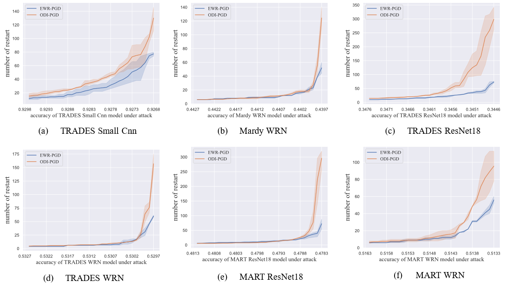
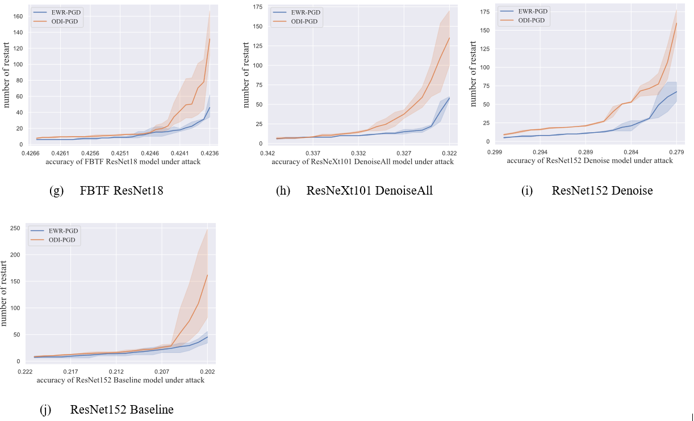

# Efficient Warm Restart Projected Gradient Descent (EWR-PGD)

We have developed a new white box adversarial attack algorithm that achieves the state-of-the-art attack performance and is more efficient than the current most advanced [ODI-PGD](https://github.com/ermongroup/ODS) algorithm.

**[2020.8.15]** Our paper **EWR-PGD** will come soon, and the code will be released with the paper.

* * *
#### Comparison of the number of restart when EWR-PGD  and ODI-PGD methods reduce the models to the same accuracy

Figure 1. EWR-PGD require fewer number of restart than ODI-PGD method when reducing the model to the same accuracy

* * *

#### results  on White-box leaderboards

* EWR-PGD ranks first on the TRADES white-box MNIST and CIFAR-10 leaderboards, reducing the accuracy of their MNIST model to 92.52% and the accuracy of their CIFAR-10 model to 52.95%. EWR-PGD also ranks first on MardyLab’s White-box CIFAR-10 leaderboard, reducing the accuracy of their CIFAR-10 model to 43.96%.

Table 1. Accuracy under EWR-PGD and SOTA attack and corresponding complexity (The lower the accuracy of model classification, the better the attack algorithm)

| dataset |model  | EWR-PGD   |EWR-PGD complexity | SOTA | SOTA complexity
| --- | --- | --- | --- | --- | --- |
| MNIST  | [TRADES-SMN](https://github.com/yaodongyu/TRADES ) | **92.52%** | **(20+300)×800** | 92.58% | ------------- |
| CIFAR-10 | [TRADES-WRN](https://github.com/yaodongyu/TRADES) | **52.96%** |**(5+100)×30**  | 53.01% |  (10+150)×20 |
| CIFAR-10 | [Mardy-WRN](https://github.com/MadryLab/cifar10_challenge) | **43.96%** | **(5+100)×30**  | 43.99% | (10+150)×20 |

* * *

#### contact
Please contact **liuye_ly94@163.com** if you have any question.Enjoy!